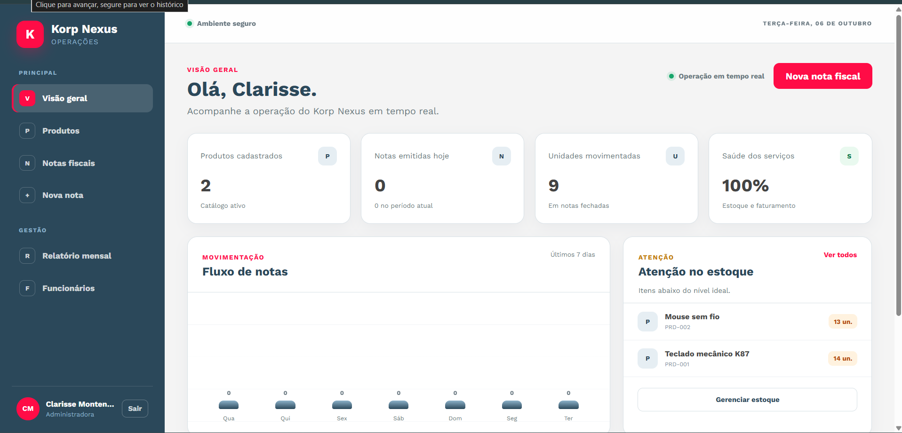
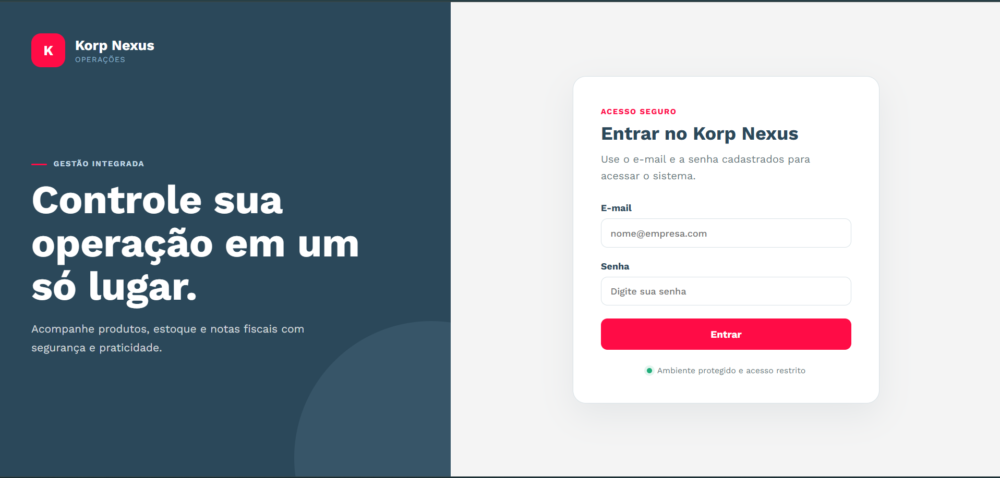
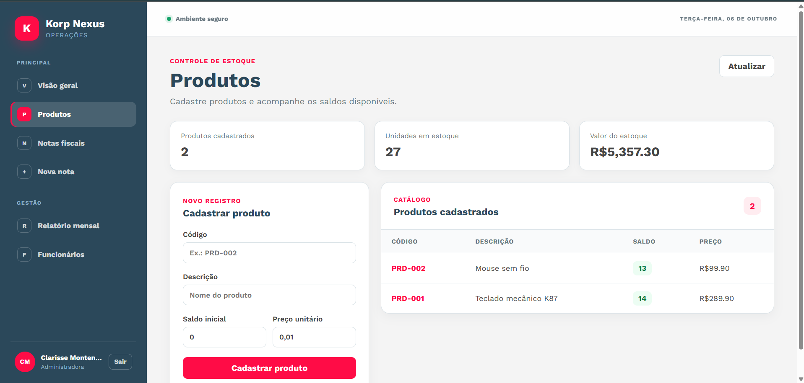
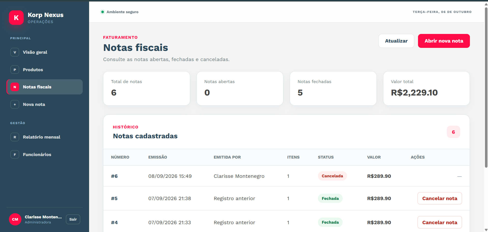
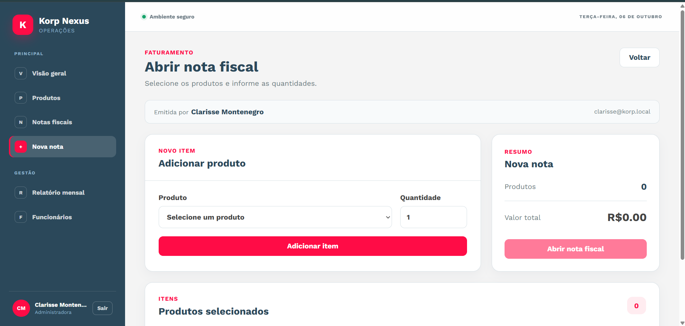
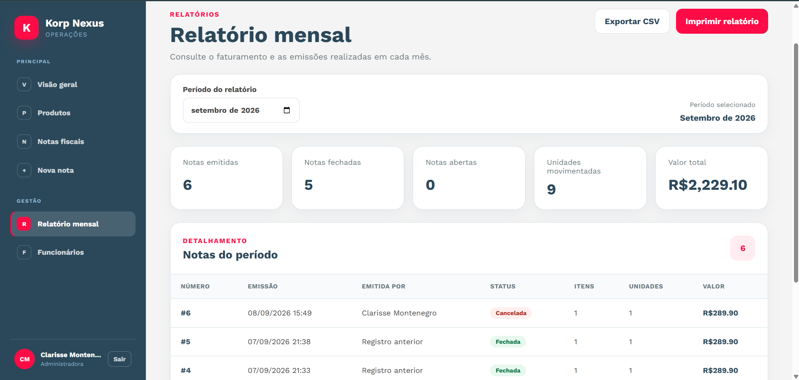
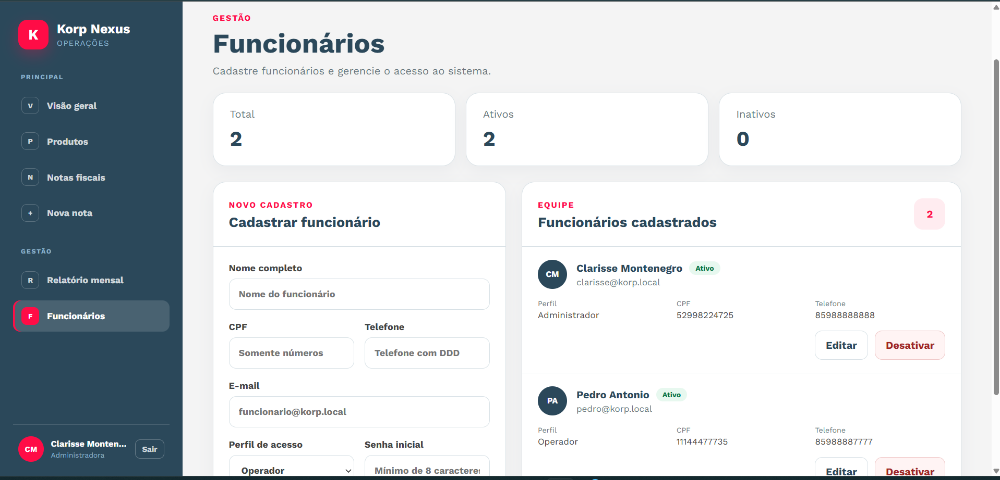
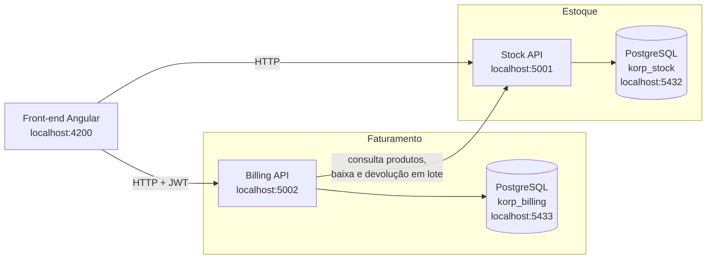

# Korp Nexus

<p align="center">
  <strong>Sistema full stack de estoque e faturamento desenvolvido com Angular, ASP.NET Core e PostgreSQL.</strong>
</p>

<p align="center">
  
  
  
  
  
  <a href="https://github.com/MontenegroEngComp/Korp_Teste_ClarisseMontenegro/actions/workflows/ci.yml"></a>
</p>

<p align="center">
  <a href="#demonstração-visual">Demonstração visual</a> •
  <a href="#funcionalidades">Funcionalidades</a> •
  <a href="#arquitetura">Arquitetura</a> •
  <a href="#tecnologias">Tecnologias</a> •
  <a href="#estrutura-de-pastas">Estrutura de pastas</a> •
  <a href="#pré-requisitos">Pré-requisitos</a> •
  <a href="#configuração">Configuração</a> •
  <a href="#execução">Execução</a> •
  <a href="#build">Build</a> •
  <a href="#integração-contínua">Integração contínua</a> •
  <a href="#segurança">Segurança</a> •
  <a href="#decisões-técnicas">Decisões técnicas</a> •
  <a href="#validações-realizadas">Validações realizadas</a> •
  <a href="#autora">Autora</a>
</p>

---

Sistema de emissão de notas fiscais com controle de estoque, desenvolvido para o teste técnico da Korp.

A aplicação é composta por um front-end em Angular e dois microsserviços em ASP.NET Core, cada um com seu próprio banco PostgreSQL: o **serviço de estoque** (produtos e saldos) e o **serviço de faturamento** (notas fiscais, funcionários e autenticação).

## Demonstração visual

<p align="center">
  
</p>

<p align="center">
  
  
</p>

<p align="center">
  
  
</p>

<p align="center">
  
  
</p>

## Funcionalidades

### Autenticação e perfis de acesso

- Login por e-mail e senha, com emissão de token JWT (validade de 8 horas).
- Senhas armazenadas com hash PBKDF2-SHA256 e salt aleatório.
- Apenas funcionários ativos conseguem entrar.
- Dois perfis:
  - **Administrador**: acesso completo, incluindo gestão de funcionários e relatório mensal.
  - **Operador**: acesso a dashboard, produtos e notas fiscais.
- As rotas restritas são protegidas no front-end (guards) e na API (`[Authorize]` com verificação de perfil).

### Produtos e estoque

- Cadastro de produtos com código (normalizado em maiúsculas e único), descrição, saldo inicial e preço unitário.
- Listagem de produtos com saldo atual.
- Baixa de estoque atômica: a atualização só ocorre se houver saldo suficiente, evitando saldo negativo em operações concorrentes.
- Operações em lote (baixa e devolução) executadas dentro de uma transação: ou todos os itens são processados, ou nenhum.

### Notas fiscais

- **Emissão**: abertura de nota com um ou mais produtos (sem repetição de produto). Código, descrição e preço são copiados do estoque no momento da emissão.
- **Identificação do emissor**: cada nota registra o funcionário autenticado que a emitiu.
- **Fechamento e impressão**: a impressão de uma nota aberta fecha a nota e realiza a baixa dos itens no estoque. Se algum produto não tiver saldo suficiente, nenhuma baixa é feita e a nota permanece aberta.
- **Cancelamento**: notas fechadas podem ser canceladas.
- **Devolução automática ao estoque**: ao cancelar, as quantidades da nota retornam ao estoque. Se a devolução falhar, a nota volta ao status fechada e a operação pode ser repetida.
- Listagem de notas com status (aberta, fechada, cancelada), itens e valor total.

### Gestão de funcionários (administrador)

- Cadastro com nome, CPF, e-mail, telefone, perfil e senha.
- CPF e e-mail únicos.
- Edição de dados, redefinição de senha, ativação e desativação.

### Dashboard

- Saudação ao funcionário autenticado.
- Notas emitidas no dia e unidades movimentadas por notas fechadas.
- Produtos com estoque baixo (até 15 unidades).
- Notas recentes e fluxo de emissão dos últimos 7 dias.
- Indicador de disponibilidade dos serviços de estoque e faturamento.

### Relatório mensal (administrador)

- Seleção do mês de referência.
- Quantidade de notas abertas e fechadas, valor total e unidades (desconsiderando notas canceladas).
- Exportação em **CSV** (separador `;`, compatível com Excel).
- **Impressão** do relatório.

## Arquitetura



- Cada serviço é dono do seu banco de dados; não há acesso direto entre bancos.
- A Billing API se comunica com a Stock API por HTTP para consultar produtos e movimentar o estoque.
- O front-end consome as duas APIs diretamente.

## Tecnologias

| Camada | Tecnologia | Versão |
| --- | --- | --- |
| Back-end | .NET / ASP.NET Core Web API | 10 (`net10.0`) |
| ORM | Entity Framework Core | 10.0.11 |
| Driver PostgreSQL | Npgsql.EntityFrameworkCore.PostgreSQL | 10.0.3 |
| Autenticação | Microsoft.AspNetCore.Authentication.JwtBearer | 10.0.11 |
| Documentação da API | Microsoft.AspNetCore.OpenApi | 10.0.11 |
| Front-end | Angular | 22.1 |
| Linguagem do front-end | TypeScript | 6.0 |
| Programação reativa | RxJS | 7.8 |
| Banco de dados | PostgreSQL (`postgres:17-alpine`) | 17 |
| Contêineres | Docker e Docker Compose | — |

O front-end usa componentes standalone, signals, detecção de mudanças sem Zone.js, Reactive Forms e SCSS.

## Estrutura de pastas

```text
.
├── .github/workflows/ci.yml        # Integração contínua
├── backend/src/
│   ├── Korp.Billing.Api/           # Faturamento, funcionários e autenticação
│   │   ├── Clients/                # Cliente HTTP da Stock API
│   │   ├── Contracts/              # DTOs de requisição
│   │   ├── Controllers/            # Auth, Employees e Invoices
│   │   ├── Data/                   # DbContext e migrations
│   │   ├── Models/
│   │   ├── Services/               # JWT e hash de senha
│   │   └── Dockerfile
│   └── Korp.Stock.Api/             # Produtos e movimentação de estoque
│       ├── Contracts/
│       ├── Controllers/            # Products e StockOperations
│       ├── Data/
│       ├── Models/
│       └── Dockerfile
├── frontend/                       # Aplicação Angular
│   └── src/app/
│       ├── core/                   # Guards, interceptor, modelos e serviços
│       ├── layout/shell/           # Menu lateral e estrutura das páginas
│       └── pages/                  # Login, dashboard, produtos, notas, funcionários e relatório
├── docker-compose.yml
├── .env.example
└── Korp.NotasFiscais.slnx
```

## Pré-requisitos

- [Docker](https://www.docker.com/) com Docker Compose v2
- [.NET SDK 10](https://dotnet.microsoft.com/download)
- [Node.js](https://nodejs.org/) 22.22.3+ ou 24.15+ (exigência do Angular 22) e npm

O .NET SDK só é necessário para compilar ou executar as APIs fora do Docker.

## Configuração

### Arquivo `.env`

O Docker Compose lê a chave do JWT e os dados do administrador inicial do arquivo `.env`, que **não é versionado**. Crie-o a partir do modelo:

```bash
cp .env.example .env
```

Antes do primeiro `docker compose up`, edite o `.env`:

| Variável | O que definir |
| --- | --- |
| `JWT_KEY` | Chave aleatória com **pelo menos 32 caracteres** (obrigatória). |
| `BOOTSTRAP_ADMIN_PASSWORD` | **Senha própria** do administrador inicial (8 a 100 caracteres). Não mantenha o valor do exemplo. |
| `BOOTSTRAP_ADMIN_EMAIL` | E-mail usado no login do administrador. |
| `BOOTSTRAP_ADMIN_NAME` | Nome (3 a 150 caracteres). |
| `BOOTSTRAP_ADMIN_CPF` | CPF com 11 números. |
| `BOOTSTRAP_ADMIN_PHONE` | Telefone (8 a 20 caracteres). |

Uma forma de gerar a chave JWT:

```bash
openssl rand -base64 48
```

Se `JWT_KEY` não estiver definida, o Docker Compose interrompe a inicialização com uma mensagem de erro. As variáveis `BOOTSTRAP_ADMIN_*` só são lidas enquanto não existir nenhum administrador no banco; depois disso, podem ser removidas do `.env`.

## Execução

### 1. Subir bancos e APIs com Docker Compose

Na raiz do repositório:

```bash
docker compose up -d --build
```

Na inicialização dentro do Docker:

1. Cada API aguarda o seu PostgreSQL ficar saudável (`healthcheck` com `pg_isready`).
2. As migrations pendentes são aplicadas automaticamente (`Database__ApplyMigrations=true`).
3. A Billing API cria o administrador inicial com os dados `BOOTSTRAP_ADMIN_*` do `.env`, **somente se ainda não existir nenhum administrador**. Administradores existentes nunca são alterados.

Se algum dado do administrador for inválido, a Billing API não inicia e o log informa qual variável corrigir, sem exibir valores:

```bash
docker compose logs -f stock-api billing-api
```

Depois de corrigir o `.env`, recrie o contêiner da Billing API para que ele leia os novos valores:

```bash
docker compose up -d billing-api
```

### 2. Acessar o sistema

Abra o front-end (passo abaixo) e entre com o `BOOTSTRAP_ADMIN_EMAIL` e o `BOOTSTRAP_ADMIN_PASSWORD` definidos no `.env`. Os demais funcionários, administradores ou operadores, podem ser cadastrados pela tela **Funcionários**.

### 3. Executar o front-end

```bash
cd frontend
npm ci
npm start
```

Acesse `http://localhost:4200`.

### Serviços e portas

| Serviço | Contêiner | URL / porta no host |
| --- | --- | --- |
| Front-end Angular | — (local) | http://localhost:4200 |
| Stock API | `korp-stock-api` | http://localhost:5001 |
| Billing API | `korp-billing-api` | http://localhost:5002 |
| PostgreSQL do estoque | `korp-stock-db` | localhost:5432 (`korp_stock`) |
| PostgreSQL do faturamento | `korp-billing-db` | localhost:5433 (`korp_billing`) |

Em ambiente `Development`, cada API publica o documento OpenAPI em `/openapi/v1.json`.

### Executar as APIs fora do Docker (opcional)

Fora do Docker, a aplicação automática de migrations e a criação do administrador inicial ficam **desabilitadas** por padrão (`Database:ApplyMigrations` e `BootstrapAdmin:Enabled` são `false` no `appsettings.json`).

A Billing API exige a configuração `Jwt:Key` ao iniciar, inclusive para o `dotnet ef`. Use o User Secrets, já habilitado no projeto:

```bash
dotnet user-secrets set "Jwt:Key" "<sua-chave>" --project backend/src/Korp.Billing.Api
```

Para aplicar as migrations manualmente (com os bancos do Compose em execução):

```bash
dotnet tool install --global dotnet-ef
dotnet ef database update --project backend/src/Korp.Stock.Api
dotnet ef database update --project backend/src/Korp.Billing.Api
```

Para habilitar os mesmos comportamentos do Docker em uma execução local, defina as variáveis de ambiente `Database__ApplyMigrations=true`, `BootstrapAdmin__Enabled=true` e `BootstrapAdmin__Password` (e demais campos `BootstrapAdmin__*`), ou use o User Secrets. Nunca grave a senha no `appsettings.json`.

### Encerrar os contêineres

Para parar e remover os contêineres **mantendo os dados** dos volumes:

```bash
docker compose down
```

> Não use `docker compose down -v`, a menos que queira apagar os volumes `stock-data` e `billing-data` e perder os dados.

## Build

Back-end (na raiz):

```bash
dotnet build Korp.NotasFiscais.slnx
```

Front-end:

```bash
npm --prefix frontend ci
npm --prefix frontend run build
```

O build de produção do Angular é gerado em `frontend/dist/frontend`.

## Integração contínua

O workflow [`.github/workflows/ci.yml`](.github/workflows/ci.yml) é executado em pull requests e em pushes para `main`, com três jobs em Ubuntu:

- **Backend**: configura o .NET 10, restaura e compila `Korp.NotasFiscais.slnx` em `Release`.
- **Frontend**: configura o Node.js 24 com cache do npm, executa `npm ci` e o build do Angular.
- **Docker Compose**: valida o `docker-compose.yml` com uma `JWT_KEY` gerada na própria execução, sem segredos reais.

O workflow não publica imagens nem realiza deploy.

## Segurança

- O arquivo `.env` está no `.gitignore`; apenas o `.env.example`, com valor demonstrativo, é versionado.
- A chave JWT não está no código nem no `appsettings.json`: vem do `.env` (Docker) ou do User Secrets (execução local).
- A senha do administrador inicial vem apenas do `.env`, é gravada somente como hash e nunca aparece nos logs. O valor do `.env.example` é apenas demonstrativo e deve ser trocado antes do primeiro `docker compose up`.
- A migração automática e o administrador inicial só são habilitados pelo `docker-compose.yml`; fora dele ficam desligados por padrão.
- Senhas de funcionários nunca são retornadas pela API (`PasswordHash` é ignorado na serialização).
- O CORS das duas APIs aceita apenas a origem `http://localhost:4200`.
- As credenciais do PostgreSQL presentes no `docker-compose.yml` e nos `appsettings.json` são **exclusivas para desenvolvimento local** e devem ser substituídas por variáveis de ambiente ou um cofre de segredos em qualquer outro ambiente.
- Pontos de atenção para uso fora do ambiente local:
  - A Stock API não exige autenticação; hoje ela depende de estar acessível apenas na rede interna.
  - O token JWT é armazenado no `localStorage` do navegador.
  - As APIs rodam em HTTP dentro dos contêineres; em produção, o tráfego deve passar por HTTPS (por exemplo, via proxy reverso).
  - As URLs das APIs estão fixas nos serviços do front-end (`localhost:5001` e `localhost:5002`).

## Decisões técnicas

- **Microsserviços com banco por serviço**: estoque e faturamento evoluem e escalam de forma independente, sem compartilhar tabelas.
- **Baixa de estoque atômica**: o saldo é decrementado com um `UPDATE` condicional (`saldo >= quantidade`), o que impede saldo negativo mesmo com requisições simultâneas.
- **Operações em lote transacionais**: a baixa e a devolução dos itens de uma nota ocorrem em uma única transação no serviço de estoque.
- **Fechamento consistente**: a nota só é marcada como fechada depois que o estoque confirma a baixa; em caso de falha, ela continua aberta e pode ser reprocessada.
- **Cancelamento com compensação**: a transição de fechada para cancelada é feita com `UPDATE` condicional, garantindo que apenas uma requisição devolva os itens. Se a devolução falhar, a nota é revertida para fechada.
- **Dados da nota preservados**: código, descrição e preço do produto são copiados para o item da nota, mantendo o histórico mesmo que o produto mude depois.
- **Emissor gravado na nota**: o ID e o nome do funcionário são salvos no momento da emissão, a partir do token autenticado.
- **Primeira execução reproduzível**: no Docker, as APIs aplicam as migrations e a Billing API cria o administrador inicial de forma idempotente, reaproveitando as regras de validação do cadastro de funcionários e o `PasswordService`. Os dois comportamentos dependem de configuração explícita e ficam desligados fora do Compose.
- **Respostas de erro padronizadas**: uso de `ProblemDetails` e mensagens em português para o usuário.
- **Imagens Docker multi-stage** executadas com usuário sem privilégios (`$APP_UID`).

## Validações realizadas

Validações executadas localmente na finalização do projeto:

| Validação | Resultado |
| --- | --- |
| `git diff --check` | Sem problemas de espaçamento |
| `dotnet build Korp.NotasFiscais.slnx` (Debug e Release) | Sucesso, 0 avisos e 0 erros |
| `npm --prefix frontend run build` | Sucesso |
| `docker compose config` com `JWT_KEY` temporária | Configuração válida |
| `docker compose config` sem `JWT_KEY` | Falha esperada, com a mensagem orientando a configurar o `.env` |
| Instalação nova com `docker compose up -d --build` (projeto e volumes isolados) | Migrations aplicadas nas duas APIs, administrador inicial criado e login realizado com sucesso |
| Reinício da Billing API com outra `BOOTSTRAP_ADMIN_PASSWORD` | Administrador existente mantido; nenhum novo funcionário criado |
| Administrador inicial com dado inválido | A Billing API não inicia e informa a variável a corrigir, sem exibir valores |
| Senha do administrador inicial nos logs | Não encontrada |
| Busca por chaves JWT, tokens e credenciais em arquivos versionados e no histórico | Nenhuma chave real encontrada; apenas o valor demonstrativo do `.env.example` e as credenciais de desenvolvimento do PostgreSQL |

O projeto ainda não possui testes automatizados além do teste gerado pelo Angular CLI.

## Autora

**Clarisse Maria Cabral Montenegro**
